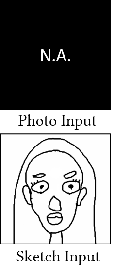
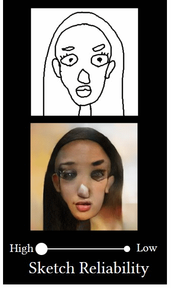
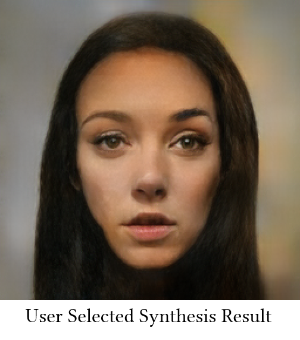
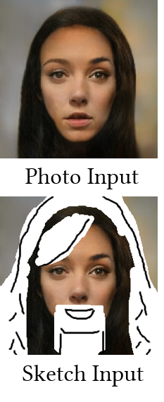
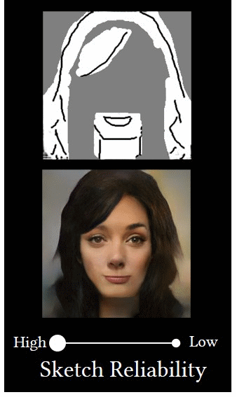
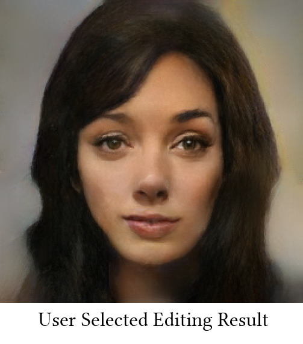
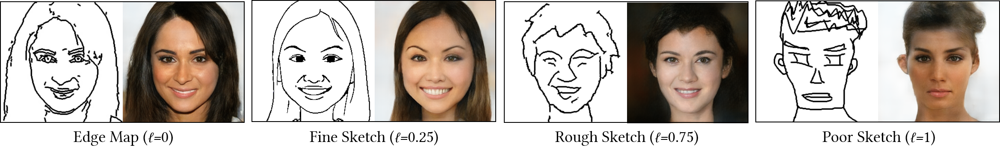

# Deep Plastic Surgery

## We are cleaning our code to make it more readable. Code is coming soon.

<table border="0" width='100%' style="FONT-SIZE:15" >
				 <tr align="center">
					<td width="9.70%" align="left"></td>
					<td width="13.90%"></td>
					<td width="20.40%"></td>
					<td width="9.70%"></td>
					<td width="13.90%"></td>	
					<td width="20.40%" align="right"></td>
				 </tr>
				 </table>
				 <table border="0" width='100%' style="FONT-SIZE:15" >
				 <tr align="center">
					<td>(a) controllable face synthesis</td><td>(b) controllable face editing</td>
				</tr>
				</table>
				 
				 <table border="0" width='100%' style="FONT-SIZE:15" >
				 <tr align="center">
					<td></td>
				</tr>				 	
				 <tr align="center">
					<td>(c) adjusting refinement level <em>l</em></td>
				</tr>
</table>

Figure 1. Our Deep Plastic Surgery framework allows users to (a) synthesize and (b) edit photos based on hand-drawn sketches. (c) Our model works robustly on various sketches by setting refinement level <em>l</em> adaptive to the quality of the input sketches, <em>i.e.</em>, higher <em>l</em> for poorer sketches, thus tolerating the drawing errors and achieving the controllability on sketch faithfulness. Note that our model requires no real sketches for training.

This is a pytorch implementation of the paper.

Shuai Yang, Zhangyang Wang, Jiaying Liu and Zongming Guo.
Deep Plastic Surgery: Robust and Controllable Image Editing with Human-Drawn Sketches, 
accepted by European Conference on Computer Vision (ECCV), 2020.

[[Project]](https://williamyang1991.github.io/projects/ECCV2020) | [[Paper]](https://arxiv.org/abs/2001.02890) | [[Human-Drawn Facial Sketches]](https://williamyang1991.github.io/projects/ECCV2020/DPS/files/human-drawn_facial_sketches.zip)

It is provided for educational/research purpose only. Please consider citing our paper if you find the software useful for your work.
